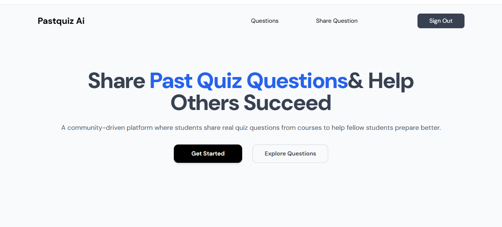

# PastQuiz 🎓

AI-Powered Past Question Answering & Study Assistant

PastQuiz is an AI-driven web application that allows students to upload
past exam questions and instantly receive clear, structured answers and
explanations. It removes the friction of searching endlessly for
solutions and provides a fast, reliable study companion powered by
Google Gemini.

🔗 **Live Demo:** https://share-interview.vercel.app/

------------------------------------------------------------------------

## 🚀 Features

-   📤 **Upload Past Questions** (text or screenshot)
-   🤖 **AI-Generated Answers** using Google Gemini
-   📘 **Detailed Explanations** for deeper learning
-   🧩 **Automatically Generated Quiz Solutions**
-   ⚡ **Fast UI** built with Vite + React + TypeScript
-   🎨 **Clean Styling** powered by Tailwind CSS
-   📱 **Fully Responsive** across devices
-   🧪 **End-to-End Tested** using Cypress
-   🔧 **Modular API Utilities** for AI workflows

------------------------------------------------------------------------

## 🧠 How the AI Works

PastQuiz uses the Gemini API to:

1.  Analyze the uploaded question\
2.  Extract text (for screenshots or images)\
3.  Generate the answer\
4.  Provide a detailed explanation\
5.  Return structured, easy-to-read study output

All AI logic can be found inside:

    api/utils/geminiClient.js  
    api/utils/generateQuizAnswers.js

------------------------------------------------------------------------

## 🛠️ Tech Stack

**Frontend:**\
- React\
- TypeScript\
- Vite\
- Tailwind CSS

**Backend / AI Layer:**\
- Google Gemini API\
- Custom Node.js utilities inside `/api/utils`

**Testing:**\
- Cypress (E2E)

**Tooling:**\
- ESLint\
- Prettier\
- Git

------------------------------------------------------------------------

## 📦 Installation

Clone the repository:

``` bash
git clone https://github.com/your-username/pastquiz.git
cd pastquiz
```

Install dependencies:

``` bash
npm install
```

Create a `.env` file in the project root:

    VITE_GEMINI_API_KEY=your_api_key_here

Start the development server:

``` bash
npm run dev
```

------------------------------------------------------------------------

## 🗂️ Folder Structure

    .
    |-- api
    |   |-- utils
    |       |-- errorHandler.js
    |       |-- geminiClient.js
    |       |-- generateQuizAnswers.js
    |
    |-- cypress
    |   |-- e2e
    |   |   |-- homepage.cy.ts
    |   |-- fixtures
    |   |   |-- example.json
    |   |-- support
    |       |-- commands.ts
    |       |-- e2e.ts
    |       |-- index.d.ts
    |
    |-- dist (production build)
    |-- index.html
    |-- tailwind.config.js
    |-- vite.config.ts
    |-- tsconfig.json

------------------------------------------------------------------------

## 🧪 Running Tests

Run Cypress UI:

``` bash
npx cypress open
```

Run Cypress in headless mode:

``` bash
npx cypress run
```

------------------------------------------------------------------------

## 🚀 Deployment

Build for production:

``` bash
npm run build
```

Preview build:

``` bash
npm run preview
```

Deploy the `dist/` folder to:

-   Vercel\
-   Netlify\
-   Firebase Hosting\
-   Any static hosting provider

------------------------------------------------------------------------

## 📸 Screenshots

*Add your app screenshots here to improve your GitHub presence.*

  Feature           Image
  ----------------- -----------------------
  Home Page | 
  AI Answer Page    *(insert screenshot)*
  Upload Workflow   *(insert screenshot)*

------------------------------------------------------------------------

## 🤝 Contributing

Pull requests are welcome.\
For major changes, please open an issue first to discuss your proposal.

------------------------------------------------------------------------

## 📜 License

MIT License © 2025 Francis
